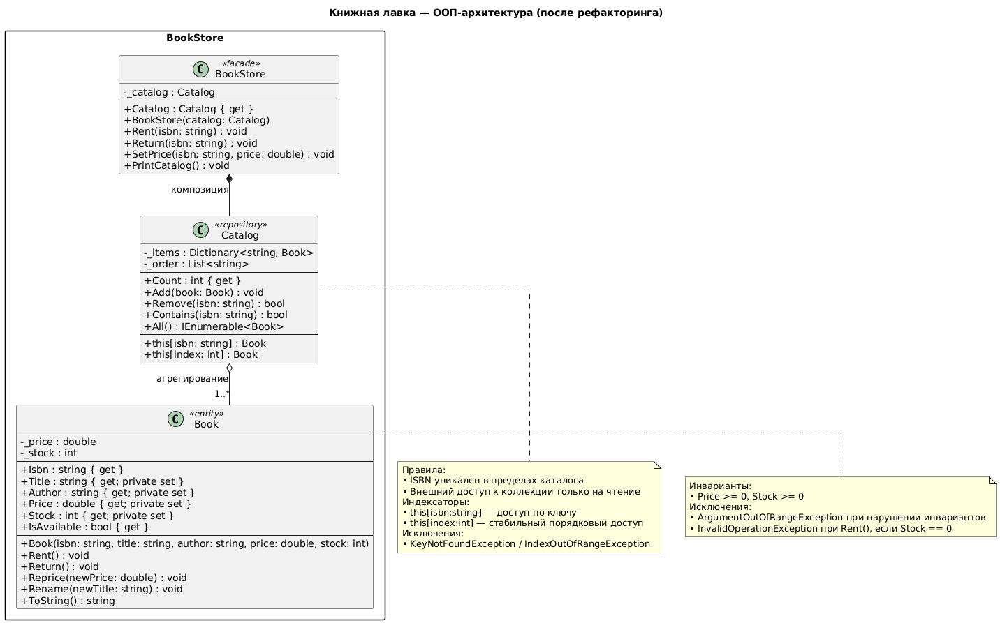

# bookstore

_Автор_: Семён Храмцов
_Направление_: Современное программирование
_Группа_: б10 (2025)
_Дата_: 16.11.2025

---

Моя домашка("Книжная лавка") по предмету ООП в СПбГУ МКН первый семестр направления Современное Программирование.

Задача домашки была преобразовать код упрощенного варианта приложения "Книжная лавка" с корректным разделением ответственности между классами и объектами.

Точно были выполнены требования из [OOPDay1.1.html](./doc/OOPDay1.1.html)

Классы реализованы в файлах `Book.cs`, `BookStore.cs` и `Catalog.cs` (каждый класс в своём файле).  В `Program.cs` написан пример использования данных классов.

Вот такая диаграмма:

